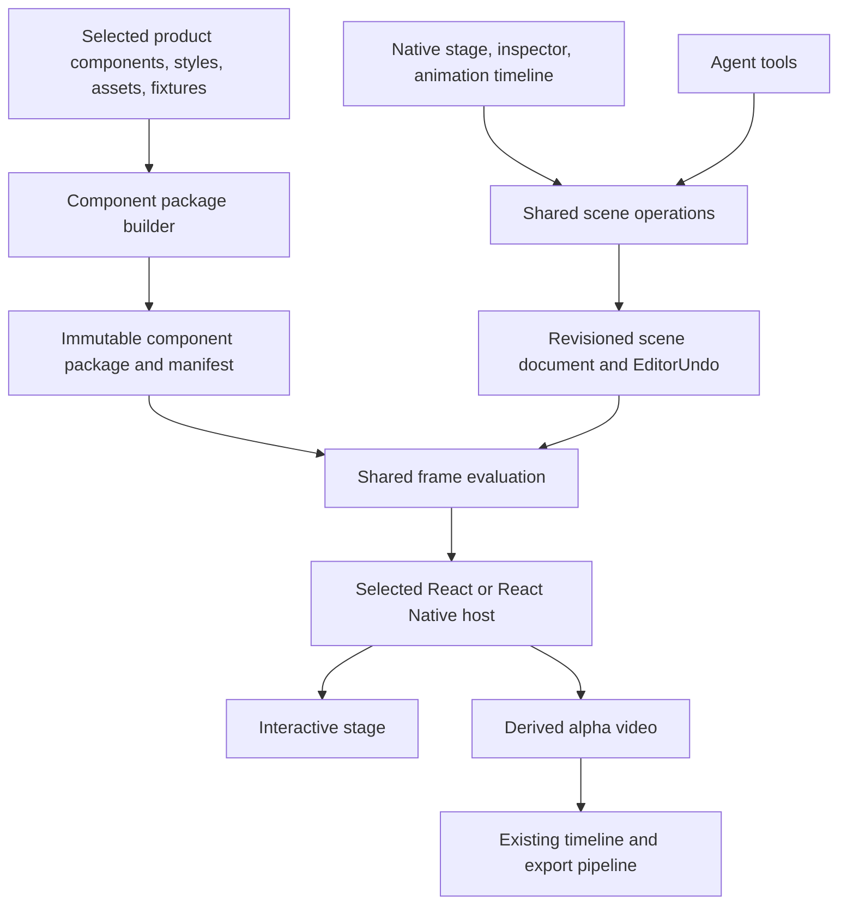

# Component-based motion design

Status: implemented architecture, 2026-09-09. Automated verification and remaining manual acceptance are recorded in [MotionEditor.md](MotionEditor.md).

## Product decision

Palmier should import real React or React Native components and let filmmakers compose and animate them visually. AI and manual editing must operate on the same editable document. Component source supplies appearance; a scene document supplies composition, exposed properties, and choreography.

The native editing shell remains SwiftUI/AppKit. Reusing a product's React UI does not require rewriting Palmier's shell in React.

Representative workflow: connect a product repository, choose its pricing card with representative data, place three instances on a stage, stagger their entrances, animate a price and button state, add a camera move and sound, then export. Every step must also work without AI.

## Implementation map

| Area | Owner |
| --- | --- |
| Structured document, validation, identity | `MotionScene`, `MotionSceneElements`, `MotionSceneValidation` |
| Mutable scene state, pinned revisions, undo | `MotionSceneStore` and `ProjectPackageCoordinator` |
| Shared authoring operations | `MotionSceneOperations`, `MotionLayoutOperations`, `MotionRecipeOperations` |
| Repository discovery, type/Storybook inference, dependency bundling | `MotionComponentAnalysis`, `MotionComponentCompiler`, `runtime/component-analyzer.ts` |
| Native authoring workspace | `MotionEditorSession`, stage, inspector, component controls, timeline, scene inspector |
| Agent discovery and semantic edits | `ToolDefinitions+MotionScene`, `ToolExecutor+MotionScene` |
| Shared frame evaluation and React tree | `runtime/scene-evaluator.js`, `runtime/scene-renderer.js` |
| Host presentation and frame acknowledgments | `MotionSceneRenderer`, `ReactNativeSceneRenderer`, `web/src/runtime.tsx`, `native/rn/` |
| Derived alpha video and embedded audio cues | `MotionVideoGenerator`, `MotionVideoEncoder`, `MotionSceneAudio` |

Swift feature files are under `Sources/PalmierPro/MotionGraphics/`; Agent files remain in the Agent feature. The structured version-2 document replaces the old source-only format; unsupported old documents are refused without modification.

## Source of truth and ownership



- A scene document has stable scene, node, track, and keyframe IDs; component package references; typed props; fixtures; hierarchy; layout; frame timing; and animation tracks. Selection and hover are transient editor state.
- Each motion asset owns one scene definition. Timeline clips reference that asset; changing the definition updates its instances. An explicit duplicate operation creates an independent definition.
- `MotionSceneStore`, owned by the current editor session on the main actor, owns mutable scene state. Views, tools, renderer hosts, and package services never become competing authorities.
- Shared domain operations validate a complete request before mutation. Each operation produces one revision and one `EditorUndo` action. Invalid, cancelled, stale, and unchanged requests create no undo entries.
- Scene evaluation is a pure function of document snapshot, component package, frame, and deterministic fixture data. Both preview and export execute the same evaluator in the selected host. The native inspector reads evaluated values; it does not implement a second evaluator.
- Existing timeline clip transforms remain outer composition operations. Scene-node transforms live inside the scene. Do not implement the same property at both levels or silently convert one into the other.
- Build, disk work, serialization, and pixel processing run behind explicit background boundaries. Only host UI work that requires the main actor runs there. Snapshot completion must carry scene identity, revision, frame, and request generation.
- Save and undo snapshots flush committed domain edits. Package mutations use `ProjectPackageCoordinator`; immutable package versions remain available while referenced by scenes or undo history.

## Importing the real UI

Connect a local repository and select exported components or existing component stories. Index exports, imports, props, styles, and asset references locally; do not send the entire repository to the model. Compile only selected entry points and their transitive dependencies.

Create a component manifest containing stable ID, runtime target, bundle hash, exported entry point, prop schema, defaults, named fixture states, supported animated properties, and optional editable slots. Type analysis can suggest controls, but it cannot reliably infer every semantic control, callback, or runtime value. Explicit registration fills those gaps.

Reuse a project's Storybook args and decorators when compatible. Map callbacks, providers, routing, and API responses to declared fixtures. Render states such as `loading`, `success`, `selected`, and `expanded` as controlled inputs so seeking does not depend on replaying clicks or network activity.

Keep the product's fonts, design tokens, CSS, and images with its package. App-owned controls continue to use `AppTheme`; product artwork keeps the product's design system. CSS and assets are scoped to the scene host.

The project pins an immutable, self-contained component package. A repository update builds a candidate package and reports changed or removed props and slots. Applying that version is explicit and undoable. Missing bindings prevent installation; they do not silently disappear. Reopening or rendering a project must work without the source checkout or network.

Importing components executes code. Preserve the current renderer's restricted resource access, and resolve assets through scoped package references. The builder must report unsupported imports or native modules, avoid ambient credentials and arbitrary installation scripts, and run separately from editor state. A restricted module registry alone is not a process security boundary.

## What can be edited visually

| Component contract | Visual capability |
| --- | --- |
| Ordinary imported component | Position, scale, rotation, opacity, duration, parent/group placement, and exposed props. |
| Registered props and fixture states | Inspector fields for text, colors, numbers, enums, assets, and state changes. Numeric values interpolate; strings and enums switch at specified frames. |
| Explicit stable slots such as `price` or `cta` | Select and animate those internal elements independently. |
| Arbitrary internal implementation or uncontrolled effects | Remains component code until adapted to expose stable props/slots and frame-driven behavior. |

Do not promise lossless conversion of arbitrary JSX into editable layers. React children, conditional branches, portals, repeated items, and RN host views do not provide stable authoring identities automatically. An opt-in slot API associates stable IDs with host bounds and animation bindings; it must preserve the component's layout semantics.

The visual workspace provides a component library and layer tree on the left, an interactive stage in the center, a schema-derived inspector on the right, and property tracks with keyframes below. The agent panel is optional.

Stage interactions include selection, multiple selection, alignment, snapping, grouping, transform handles, zoom, and separate design/interact modes. Repeated slots need stable item keys. Portals require explicit host mapping. Coordinate conversion must account for nested transforms, zoom, device scale, and scene size.

Dragging previews a transient transaction; mouse-up validates and commits once. Escape cancels it. Selection changes, focus loss, project closure, and conflicting AI revisions cannot commit a stale drag. Auto-keyframe mode writes to the active property track; otherwise the inspector edits its base value.

Build a complete motion feature set in layers: transform and prop tracks first; then curves, spring controls, staggering, reusable entrance/hold/exit recipes, groups and camera rigs; then text segmentation, masks, paths, repeat behaviors, format variants, and audio-aligned cues. Recipes remain structured and editable; expanding a recipe into individual keys is an explicit authoring action.

## Runtime choice and frame correctness

React DOM components use the web host. Supported RN components use the React Native macOS host. One scene declares one runtime; both kinds can coexist as clips in the existing video timeline. Mixed host trees are outside the initial contract.

React Native macOS does not guarantee an iOS- or Android-identical result. Platform-specific views and native modules need target-specific support. React Native Web is an optional import target for compatible components, not an automatic substitute. Report unsupported components during import. Exact device-only behavior is a separate future device-rendering capability.

For editable animation, define `render(frame)` independently of previous frames. A request order of `0, 200, 20, 200` must give the same frame 200 each time and match export. Seeded random state alone does not establish this property. Frame-dependent randomness must also be independent of evaluation order.

Use frame-derived properties and controlled fixture states for animated product interactions. Arbitrary `useEffect`, timers, CSS transitions, Motion layout animation, and native animation drivers do not automatically satisfy random-access rendering. Components must adapt to the frame contract or be reported as unsupported for that behavior.

The render protocol acknowledges the requested revision and frame after React commit, layout, assets/fonts, and host presentation readiness. Fixed sleeps are not a completion contract. Bound and coalesce interactive requests; discard stale completions. Full video baking must not gate every pointer movement.

Cache keys include scene content, package/dependency hashes, evaluator and renderer versions, frame/output settings, fonts/assets, and color/alpha policy. Set explicit capacities and eviction policies. Deduplicate identical work, cancel unneeded requests, and invalidate on every relevant revision. An old bake can never be reported as the current scene.

## Token-efficient AI operations

The primary saving comes from referencing real components and editing data rather than regenerating source. Manual edits require no model call.

1. Search a compact component index by task and runtime. Return IDs and brief descriptions with pagination; fetch schemas only for selected components.
2. Read the selected scene subtree, relevant tracks, and revision. Fetch source only to build or repair a component adapter.
3. Use filmmaker actions such as compose a scene, animate selected layers, or change component content. Apply each complete intent atomically through the same operations as the UI.
4. Reference animation recipes and fixtures by stable ID. Resolve timing, selection, and stagger ordering once inside the domain operation.
5. Return revision, changed IDs, no-op state, warnings, and undo receipt. Require an expected revision to reject stale writes and request IDs to handle retries safely.
6. Inspect a few relevant frames or a small contact sheet after significant edits. Do not send full source, the entire catalog, or every frame in routine responses.

Implemented `manage_motion_scene` animation request (replace receipt IDs and revision with values from `read`):

```json
{
  "action": "animate",
  "mediaRef": "<motion asset UUID>",
  "expectedRevision": "<revision from read>",
  "requestId": "entrance_01",
  "targets": ["card_basic", "card_pro", "card_team"],
  "recipe": "slide-up-fade",
  "startFrame": 0,
  "durationFrames": 18,
  "staggerFrames": 4
}
```

Measure actual savings on the same tasks: create a three-card scene, change a label, adjust staggering, replace a fixture, and repair a failed import. Record input/output tokens including schemas, retries and image inspection, plus tool calls, latency, and task success. No numerical savings claim is justified before this comparison.

For implementation work, keep this architecture and a compact feature map as reusable context. Work in vertical slices, inspect owning files, and store verification results with each slice. Avoid repeatedly loading the repository or implementing independent UI and agent versions of a feature.

## Delivery sequence and acceptance criteria

| Slice | Deliverable | Acceptance |
| --- | --- | --- |
| 1. Real component end to end | One repository React component with bundled CSS/font/assets, controlled fixture, scene document, native prop inspector, transform track, and export. | Import, edit visually, scrub backward, save/reopen, and export matching frames without model calls. |
| 2. Visual authoring | Layer tree, stage handles, multiple selection, snapping, property lanes, and curves. | One drag equals one undo; Escape cancels; direct frame seeks match sequential rendering. |
| 3. Shared AI workflow | Component discovery and semantic compose/animate/content operations. | MCP readback confirms edits, no-op and conflict receipts, UI/AI undo interleaving, and terminal job outcomes. |
| 4. Product UI depth | Stable internal slots, fixture state tracks, package updates, and RN import support. | A real product card and supported RN screen expose declared controls; unsupported dependencies are reported; old package references survive undo. |
| 5. Full motion toolkit | Masks, text choreography, camera/group rigs, repeat behaviors, sound cues, and reusable format variants. | Each feature is manually authorable, seekable, undoable, persistable, and exportable. |

Remove the single-source-scene authoring path when the structured replacement is complete. Do not maintain dual editable formats, compatibility fallbacks, or automatic migrations. If old scene files become unsupported, reject them explicitly without modifying them.

Place document/store/operations under `Sources/PalmierPro/MotionGraphics/`; renderer-neutral evaluation and contracts under `runtime/`; host adapters under `web/` and `native/rn/`; native authoring views with the motion feature. Keep the builder separate from the renderer. Final package subdivision should follow the first working slice, not precede it.

## Verification plan

Automate document validation, stable identity, serialization, transaction no-ops, exact undo, concurrent revision conflicts, stale results, cancellation, package-install failure, and cleanup. Compare sampled preview/export frames within a defined pixel tolerance, and validate alpha, color, dimensions, and timing independently. Test frame requests in different orders and with fonts or assets initially unavailable.

Run `swift build`, focused motion tests, and `swift test` for the shared editor/persistence/concurrency changes. Build the web runtime with its declared `npm run build` script and verify its bundled resources. Test the optional ReactNative trait both enabled and disabled with the required host artifacts present. Exercise the actual MCP boundary against an isolated project.

Manual UI verification requires user confirmation: import a fixture product, select and drag a component, alter a prop, set and move keys, scrub backward, cancel with Escape, switch focus, undo a mixed UI/AI edit, and reopen the saved project. Cover empty scenes, disabled/locked selection, missing source checkout, Save As, close during build/bake, and retry after failure. Expected results are stable selection, exact restoration, no stale commit, and an explicit terminal result.

Measure interaction latency, frame throughput, and memory on the same representative workload before and after changes, including many repeated components and long scenes. See the verification record in [MotionEditor.md](MotionEditor.md) for commands, observed results, and limits. Manual UI acceptance and a comparable before/after token or performance study remain outstanding; no numerical improvement is claimed.

## External references

- [Remotion: frame-driven animation](https://www.remotion.dev/docs/animating-properties) supports the frame-evaluation model. Palmier already has a small Remotion-shaped API; this implementation does not assume that it implements the full Remotion SDK.
- [Remotion Player](https://www.remotion.dev/docs/player) is an embeddable React video player. Adopting it would require a separate integration decision; it does not establish Palmier's component import, native hosting, scene ownership, or undo architecture.
- [Storybook args](https://storybook.js.org/docs/writing-stories/args) provide a useful starting point for reusable component fixture data and controls.
- [React Native platform-specific code](https://reactnative.dev/docs/platform-specific-code.html) and [native components](https://reactnative.dev/docs/intro-react-native-components) explain why target support cannot be inferred from React syntax alone.
- [React Native for Web](https://necolas.github.io/react-native-web/docs/) supplies a web target for compatible RN components; adopting that target changes the rendering platform.
